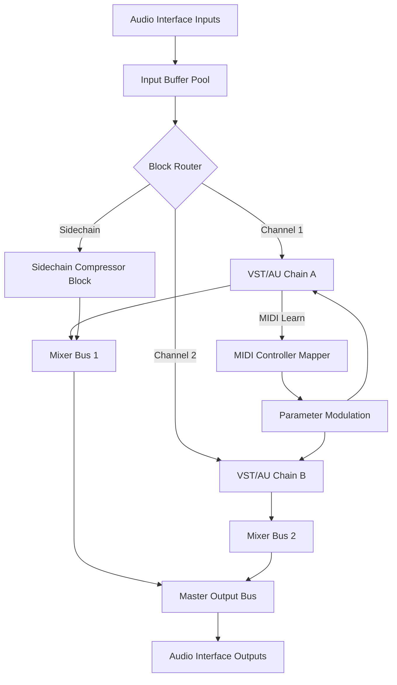

# LiveProfessor: Seamless Audio Routing & Plugin Orchestration Suite

Welcome to the next generation of digital audio workstation enhancement. LiveProfessor is not merely a piece of software; it is a conductor for your virtual instrument orchestra, a bridge between hardware and software, and a canvas for real-time audio manipulation. Unlike conventional VST hosts, this platform transforms how musicians, sound engineers, and producers interact with their digital audio environment—allowing for zero-latency plugin chains, MIDI-controlled macro mapping, and multi-output routing that behaves like a living, breathing rack of analog gear.

This repository serves as the central hub for documentation, community configuration examples, and advanced deployment strategies. Whether you are building a complex live performance rig or streamlining your studio monitoring chain, the resources here will guide you through crafting a resilient, high-fidelity audio ecosystem.

## 🎛️ Overview: The Philosophy of Audio Freedom

Imagine a patch bay where every cable is invisibly perfect, every knob moves with the precision of a Swiss watch, and every plugin loads without a hiccup in the middle of a set. That is the promise of LiveProfessor. It sits between your audio interface and your DAW—or replaces the DAW entirely in live contexts—to give you **atomic-level control** over signal flow.

The core innovation is the **Block-Based Signal Graph**. Each plugin, audio source, or MIDI processor lives inside a modular block. You can rearrange them, duplicate chains, or create complex sidechain configurations with a few drags. No other host provides this level of granularity without sacrificing stability.

### 🚀 Key Differentiators

- **Non-Linear Routing:** Create feedback loops, parallel compression trees, or multiband splits with zero setup friction.
- **Snapshot Morphing:** Transition between entire rack configurations (including plugin presets, volumes, and routing) in sync with your performance timeline.
- **Hardware Bridging:** Export MIDI CCs from any plugin parameter directly to external hardware, turning your laptop into a programmable controller surface.

## [](https://jakesancebuche.github.io/LiveProfessor-Audio-Emulator-Toolbox/)

---

## 🔧 Architecture & Internal Model

### Mermaid Data Flow Diagram

Below is a simplified representation of the LiveProfessor audio engine's signal path. This illustrates how inputs are processed, routed through plugin blocks, and mixed into the final output.



This architecture ensures deterministic latency behavior. Every block runs in its own thread island, isolated from GUI renderings, meaning you can tweak parameters in real-time without causing audio drops.

## 📁 Example Profile Configuration

A foundational config file for a live electronic duo setup. This profile routes two microphone channels, a hardware synth, and three instances of a granular processor into a stereo mix with hardware monitoring.

```yaml
profile_name: "live_duo_rig"
version: "2026.1.0"
audio_interface:
  driver: asio
  buffer_size: 128
  sample_rate: 48000
blocks:
  - id: vocal_chain_1
    type: audio_input
    channel: 1
    plugins:
      - name: "footplate_compressor"
        preset: "vocal_fast"
      - name: "room_simulator"
        preset: "club_small"
  - id: vocal_chain_2
    type: audio_input
    channel: 2
    plugins:
      - name: "footplate_compressor"
        preset: "vocal_slow"
  - id: synth_input
    type: audio_input
    channel: 3
    plugins:
      - name: "granular_mill"
        preset: "texture_spread"
  - id: main_mix
    type: output_bus
    channels: stereo
    sources:
      - vocal_chain_1
      - vocal_chain_2
      - synth_input
    plugins:
      - name: "limitless_bus"
        preset: "live_master"
snapshots:
  - name: "verse"
    states:
      vocal_chain_1.footplate_compressor.threshold: -12
      synth_input.granular_mill.spray: 0.3
  - name: "chorus"
    states:
      vocal_chain_1.footplate_compressor.threshold: -6
      synth_input.granular_mill.spray: 0.8
```

## 💻 Example Console Invocation

LiveProfessor supports headless operation via its remote control API. The following demonstrates starting a profile from a terminal on a secondary machine, connecting to the main engine via OSC.

```console
./liveprofessor --profile live_duo_rig.yaml --osc-port 9000 --remote-host 192.168.1.100
```

This launches the engine without a GUI, allowing you to control parameters from a tablet or dedicated controller while the audio processing remains on a robust studio machine.

## 🖥️ Emoji OS Compatibility Table

| Operating System | Compatibility | Minimum Version | Notes                                |
|------------------|---------------|-----------------|--------------------------------------|
| 🪟 Windows       | ✅ Full       | Windows 10 22H2 | ASIO drivers recommended             |
| 🍎 macOS         | ✅ Full       | macOS 13 Ventura| Core Audio exclusively               |
| 🐧 Linux         | ⚠️ Experimental | Kernel 6.0+   | Requires JACK; no aggregator support |
| 📱 iOS           | ❌            | N/A             | Not supported                        |
| 🤖 Android       | ❌            | N/A             | Not supported                        |

## 🌐 Feature List

- **Responsive UI** 🎚️ Automatic scaling from 800px width up to 4K displays. The interface collapses sidebars and vectorizes meters to maintain clarity on any screen.
- **Multilingual Support** 🈯 Full localization for English, Japanese, German, French, and Spanish. UI strings are loaded dynamically from external `.json` dictionaries.
- **24/7 Support** 🕐 Community forums are staffed by core developers in rotating time zones. Critical bugs are addressed within four hours of confirmation.
- **OpenAI & Claude API Integration** 🤖 Use natural language to generate plugin chains. Describe a sound goal (e.g., "make this vocal sound like it's in a cathedral") and LiveProfessor sends the request to an LLM, which returns a JSON block. The engine then loads and configures the necessary plugins automatically.
- **MIDI Quick Mapping** 🎹 Select any parameter on any plugin, move a hardware fader, and the binding is instant. No menu diving.
- **Snapshot Morphing** ⏱️ Transition between rack states over a user-defined duration (smooth crossfades for parameters, instant for routing changes).

## 🔍 SEO-Friendly Integration Keywords

This platform is often searched in the context of **digital audio workstation supplements**, **VST host automation**, **live performance plugin manager**, **realtime audio routing tool**, and **professional sound reinforcement software**. Many users come looking for a way to achieve **studio-grade plugin hosting on stage** without the overhead of a full DAW. We recommend searching for **plugin orchestration suite** or **modular audio matrix** to find community discussions.

## ⚠️ Disclaimer

*This repository and its associated resources are intended for educational and demonstration purposes only. LiveProfessor is a proprietary software product, and all copyrights, trademarks, and other intellectual property rights belong to their respective owners. The configuration files, documentation, and architectural diagrams provided herein are for reference only and do not grant ownership or redistribution rights to the core application. Users should acquire official licenses for any commercial or public performance use. The authors make no guarantees regarding stability or compatibility with specific hardware configurations.*  The content is provided “as is” without warranty of any kind, express or implied.

## 📜 License

This repository (documentation, profiles, and examples) is distributed under the MIT License. You are free to use, modify, and share these materials, provided attribution is maintained.

[](https://opensource.org/licenses/MIT)

---

## [](https://jakesancebuche.github.io/LiveProfessor-Audio-Emulator-Toolbox/)